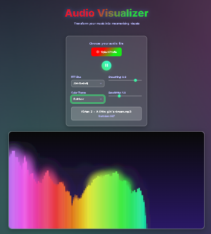

<p align="center">
  
  
  
  
</p>

<h1 align="center">🎶 Advanced Audio Visualizer</h1>

<p align="center"><em>Bring your music to life with a stunning, interactive, real-time audio visualizer. Modern UI, deep customization, and vibrant animations — all in your browser.</em></p>

---

## 🎨 Features

- **Universal Audio Support:** Upload any audio file (`.mp3`, `.wav`, `.ogg`, etc.)
- **Fully Customizable:** Adjust FFT size, smoothing, sensitivity, and color themes
- **Modern Control Panel:** Responsive, accessible, and intuitive controls
- **Dynamic Canvas Visuals:** Gradients, glow effects, and multiple color modes
- **Playback Controls:** Play/pause, duration display, and keyboard shortcuts
- **Color Modes:** Spectrum, Rainbow, Fire, Ocean, Neon, Monochrome
- **Glassy UI:** Soft shadows, animated backgrounds, and scalable layouts

---

## 📸 Preview

<p align="center">
  
</p>

---

## 🛠️ Tech Stack

- **HTML5** & **CSS3** (with CSS variables & glassmorphism)
- **JavaScript** (ES6+)
- **Web Audio API**
- **Canvas API**

---

## 🗂️ Project Structure

```
├── index.html      # Main UI and structure
├── index.js        # Audio logic and visualization engine
├── style.css       # Complete UI styling and responsiveness
└── image.png       # Preview image (UI screenshot)
```

---

## 🧠 How It Works

- Leverages the **Web Audio API** to decode and analyze frequency data in real time
- Maps frequency bins to animated, colorful bars on a canvas
- Live customization via UI controls:
  - **FFT Size:** Frequency resolution
  - **Smoothing:** Animation smoothness
  - **Sensitivity:** Bar height amplification
  - **Theme:** Instantly switch color schemes
- Built for accessibility, responsiveness, and interactivity

---

## ⚙️ Controls & Shortcuts

| Action             | Control                      |
|--------------------|-----------------------------|
| Upload Audio       | File Upload Button           |
| Play / Pause       | Spacebar or Play Button      |
| Fullscreen Canvas  | Press `F`                    |
| Reset Settings     | Press `R`                    |

---

## 🧪 Getting Started

1. **Clone or Download** this repository.
2. Open `index.html` in your browser.
3. Upload an audio file.
4. Use the control panel to customize your visualizer.

> No setup or dependencies required — works entirely in your browser!

---

## ♿ Accessibility

- Semantic HTML structure
- `aria-label`s and screen reader support
- Fully responsive (mobile to widescreen)
- Reduced motion support for sensitive users

---

<p align="center"><strong>💥 Experience your music visually — right in your